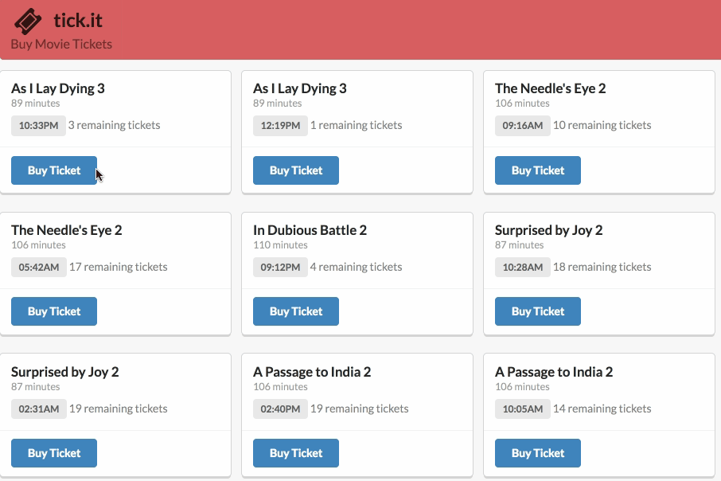

# Module 3 Code Challenge



## Deliverables

You will be building out an application that allows a user to purchase movie tickets.

* As a user, when the page loads I should see a list of movie showings fetched from a remote API.

* As a user, clicking on the 'Buy Ticket' button should purchase a ticket and decrement the remaining tickets by one. This information should be persisted in the remote API.

* As a user I should not be able to purchase a ticket for a sold out showing.

## Implementation Notes

### The API

The backend for this challenge can be found at `https://evening-plateau-54365.herokuapp.com/`

There are two API endpoints you will use, one to fetch all of the data associated with your assigned theatre and the other to create tickets in the database.


#### GET `/theatres/:id`

**Before you do anything else, change the variable `theatreId` in your index.js file to your assigned id.**

Use your assigned id to get the data all of the showings at your theatre.

GET `https://evening-plateau-54365.herokuapp.com/theatres/:id`

Example response:
```json
{
  "id": 3,
  "name": "Flatiron Theatres #3",
  "showings": [
    {
      "id": 30,
      "film": {
        "title": "The Torment of Others 2",
        "runtime": 96
      },
      "capacity": 20,
      "showtime": "01:59AM",
      "tickets_sold": 1
    },
    {
      "id": 29,
      "film": {
        "title": "The Torment of Others 2",
        "runtime": 96
      },
      "capacity": 20,
      "showtime": "08:41PM",
      "tickets_sold": 6
    },
    {
      "id": 28,
      "film": {
        "title": "The Torment of Others 2",
        "runtime": 96
      },
      "capacity": 20,
      "showtime": "06:50AM",
      "tickets_sold": 1
    },
    {
      "id": 27,
      "film": {
        "title": "All Passion Spent 4",
        "runtime": 88
      },
      "capacity": 20,
      "showtime": "10:11AM",
      "tickets_sold": 10
    },
    {
      "id": 26,
      "film": {
        "title": "All Passion Spent 4",
        "runtime": 88
      },
      "capacity": 20,
      "showtime": "11:02PM",
      "tickets_sold": 7
    },
    {
      "id": 25,
      "film": {
        "title": "All Passion Spent 4",
        "runtime": 88
      },
      "capacity": 20,
      "showtime": "06:58PM",
      "tickets_sold": 1
    },
    {
      "id": 24,
      "film": {
        "title": "Consider Phlebas",
        "runtime": 118
      },
      "capacity": 20,
      "showtime": "11:36PM",
      "tickets_sold": 2
    },
    {
      "id": 23,
      "film": {
        "title": "Consider Phlebas",
        "runtime": 118
      },
      "capacity": 20,
      "showtime": "09:47AM",
      "tickets_sold": 14
    },
    {
      "id": 22,
      "film": {
        "title": "Consider Phlebas",
        "runtime": 118
      },
      "capacity": 20,
      "showtime": "06:13AM",
      "tickets_sold": 2
    },
    {
      "id": 21,
      "film": {
        "title": "Those Barren Leaves, Thrones, Dominations 3",
        "runtime": 107
      },
      "capacity": 20,
      "showtime": "03:55AM",
      "tickets_sold": 4
    },
    {
      "id": 20,
      "film": {
        "title": "The Last Temptation 2",
        "runtime": 85
      },
      "capacity": 20,
      "showtime": "08:48PM",
      "tickets_sold": 3
    }
  ]
}
```

A theatre has many showings.

The number of tickets remaining for a showing can be determined by subtracting the current `tickets_sold` from the total `capacity` of the showing.


#### POST `/tickets`

To create a new ticket it must belong to a showing. The body of the request must contain a key called  `showing_id`

POST `https://evening-plateau-54365.herokuapp.com/tickets`

```
Required Headers
{
  'Content-Type': 'application/json',
  Accepts: 'application/json'
}

Required Keys
(in body of request - must be stringified)
{
  showing_id: <add showing_id here>
}

```

Example Responses:
* Successfully created ticket
```json
{"id": 3820, "showing_id": 182, "created_at": "2017-11-13T12:12:28.682Z"}
```
* Sold out
```js
{"error": "That showing is sold out"}
// status 422
```

#### Important Note

**Once this response is received you need to decrease the number of remaining tickets.** You could imagine one way of doing this would be to find the particular part of the DOM that needs to be updated and changing only that small part.

Instead, we would recommend **updating the entire list of film showings by making another fetch request, clearing out the current list, and re-inserting the new elements into the DOM**. This may seem more inefficient, but it is likely simpler to implement and closer to patterns we will see in the future.

In the end, whatever way you can get this working is totally ok!


### Styling

[Semantic Ui](https://semantic-ui.com/elements/list.html) is loaded into this project via a `link` tag in the `head` of the html.

The cards that represent a movie showing should be appended to the div with the class of  `showings`.  Each card should have the following html

```html
<div class="card">
  <div class="content">
    <div class="header">
      (Film Title)
    </div>
    <div class="meta">
      (Runtime) minutes
    </div>
    <div class="description">
      <span class="ui label">
        (Showtime)
      </span>
      (Num Tickets) remaining tickets
    </div>
  </div>
  <div class="extra content">
    <div class="ui blue button">Buy Ticket</div>
  </div>
</div>
```

### Considerations

You are free to solve this in any way you choose. It is not required that you have ES6 classes or use Object Orientation. We would recommend beginning with a straightforward functional implementation and refactoring to objects as needed.

jQuery is included in this project, you can choose to use jQuery or vanilla JS.
